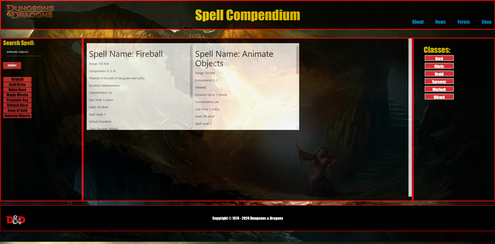

# Spell Compendium 5e
<div align="center">

  <!-- Add badges using the following format: -->
  <!-- (urlToGithubHere) -->

[](https://opensource.org/licenses/MIT)
[](https://github.com/Wartech93/404_Project/graphs/contributors)
[](https://github.com/Wartech93/404_Project/network/members)
[](https://github.com/Wartech93/404_Project/stargazers)
[](https://github.com/Wartech93/404_Project/issues)
[](https://linkedin.com/in/Wartech93)

</div>

<!-- PROJECT LOGO -->

<div align="center">
  <a href="https://github.com/Wartech93/404_Project">
    
  </a>

  <h3 align="center">404_Project</h3>

  <p align="center">
    Brought to you Val Spadoni, Alberto Lawant, and Royce Atkins<br />
    <a href="https://github.com/Wartech93/404_Project"><strong>Explore the docs »</strong></a>
    <br />
    <br />
    <!-- TODO- add deployed link -->
    <a href="https://github.com/Wartech93/404_Project">View Demo</a>
    ·
    <a href="https://github.com/Wartech93/404_Project/issues">Report Bug</a>
    ·
    <a href="https://github.com/Wartech93/404_Project/issues">Request Feature</a>

  </p>
</div>

<!-- TABLE OF CONTENTS -->
<details>
  <summary>Table of Contents</summary>
  <ol>
    <li>
      <a href="#about-the-project">About The Project</a>
      <ul>
        <li><a href="#built-with">Built With</a></li>
      </ul>
    </li>
    <li>
      <a href="#getting-started">Getting Started</a>
      <ul>
        <li><a href="#installation">Installation</a></li>
      </ul>
    </li>
    <li><a href="#usage">Usage</a></li>
    <li><a href="#roadmap">Roadmap</a></li>
    <li><a href="#contributing">Contributing</a></li>
    <li><a href="#license">License</a></li>
    <li><a href="#contact">Contact</a></li>
    <li><a href="#acknowledgments">Acknowledgments</a></li>
  </ol>
</details>

<!-- ABOUT THE PROJECT -->

## About The Project

This project was built with JS/CSS/HTML and Materialize with the help of APIs in order to show our students an example project.
We created an application that allows you to have all your spells for your favorite class at your fingertips. It also allows you to see spell casting information for any spell casting class available.

### Built With

<div align="center">

[](https://javascript.info/)
[](https://html.com/)
[](https://developer.mozilla.org/en-US/docs/Web/CSS)
[](https://materializecss.com/)
[](https://code.visualstudio.com/docs)


## APIs used


</div>

<!-- GETTING STARTED -->

## Getting Started

Once completely built, this application will function as a deployed app on Github Pages.

### Local Installation / Testing

1. Clone the rep

```
git clone https://github.com/Wartech93/404_Project.git
```

2. Right click on index.html and open in browser to enjoy locally!

<!-- USAGE EXAMPLES -->

## Usage




<!-- ROADMAP -->

## Roadmap


#### MVP

- [ ] Feature
  - [ ] Feature detail
  - [ ] Feature detail

#### Future Development

- [ ] Add delete buttons to spell cards
- [ ] Clear Search Box after submit
- [ ] Feature

See the [open issues](https://github.com/Wartech93/404_Project/issues) for a full list of proposed features (and known issues).

<!-- CONTRIBUTING -->

## Contributing

Contributions are what make the open source community such an amazing place to learn, inspire, and create. Any contributions you make are **greatly appreciated**.

If you have a suggestion that would make this better, please fork the repo and create a pull request. You can also simply open an issue with the tag "enhancement".
Don't forget to give the project a star! Thanks again!

1. Fork the Project
2. Create your Feature Branch (git checkout -b feature/AmazingFeature)
3. Commit your Changes (git commit -m 'Add some AmazingFeature')
4. Push to the Branch (git push origin feature/AmazingFeature)
5. Open a Pull Request

<!-- LICENSE -->

## License

This project is licensed under the MIT license.

See LICENSE.txt for more information.

<!-- CONTACT -->

## Collaborator Git Hubs

[Alberto Lawant](https://github.com/ParryProgramming)


[Royce Atkins](https://github.com/Wartech93) 


[Val Spadoni](https://github.com/oooWeeee)

Project Links:

<!-- TODO- add FIGMA board -->

[Figma Board- link later](https://www.figma.com/file/MmUIY63mzXYa0i2OFtfrSB/Spell-Compendium-Wireframe?type=design&node-id=0-1&mode=design&t=RnTcg3nMZ37HrWH7-0)

[Github Repository](https://github.com/Wartech93/404_Project)

<!-- TODO- add deployment link -->

[Deployment](https://wartech93.github.io/404_Project/)

<!-- ACKNOWLEDGMENTS -->

## Acknowledgments

We would like to give a shoutout to the TAs Mary and Cody as well as John for helping us fix all of our issues and making our page look awesome! Also for our class mates that spent the time to work with us and make this such a fun project!
